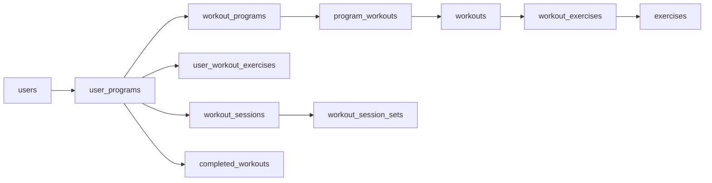

# Database design

The [DBML](oneset.dbml) keeps the original ten tables plus `completed_workouts`. It is implemented by [migration 001](migrations/001_documented_schema.sql), applied to the `oneset` database on project `wispy-bird-47588933`'s `production` branch on 2026-09-29. Scope: gym workouts, weight and reps, one working set per exercise, one training device at a time. Clerk owns account profiles and access.

## Tables and their purpose

| Table | Purpose and fields worth keeping |
| --- | --- |
| `workout_programs` | Program name and recommended weeks. |
| `workouts` | Reusable workout ID and name. |
| `program_workouts` | Links a program to its ordered workouts. Frequency is the count of current entries, not another field. |
| `exercises` | Name, instructions, private video key, default rep range, rest and warmup guidance. Defaults support user-selected replacements. Instructions include when to stop the set and total-load/per-side conventions. |
| `workout_exercises` | Exercise, order and workout-specific `reps_min`/`reps_max`. An exercise can have different targets in different workouts. Its existing ID identifies the slot. |
| `users` | Clerk identity link, kg/lb preference, training-day preference and active program run. No name/email copies, access timestamps or settings revision. |
| `user_programs` | One run through a program, with owner, program and start time. A new cycle is another row. |
| `user_workout_exercises` | Remembered replacement, note and rest preference for a run's original exercise slot. Missing row means use defaults. |
| `workout_sessions` | One attempt at a run/week/workout, copied workout name, start/finish times, optional note and upload revision. Ownership comes through `user_programs`; no duplicate user ID. |
| `workout_session_sets` | One row per original slot, including unfinished work. Stores actual exercise, copied order/guidance/note, weight, entered unit, reps and completion time. |
| `completed_workouts` | Three-column run/week/workout completion mark. Kept separately only because deleting history must not rewind program progress. |



## Runs and remembered choices

Switching back to a program resumes its latest run, ordered by `started_at DESC, id DESC`. Starting a new cycle creates another run and selects it through `users.active_user_program_id`. Start times and run identities are fixed after creation. There is no `is_current` flag to keep synchronized. The app blocks switching/new cycles during an active workout.

Copy remembered preferences once when creating a new run, matching `workout_exercise_id` still present in the current program template. On the device, copy from its current source run, including locally saved preferences; upload that initial preference copy with the new run. The server validates ownership/slot membership and inserts both and selects the new run atomically on first creation. A retried creation returns the existing run and never recopies preferences or replays activation. Later preference changes use the latest saved values; no run revision or preference conflict workflow is needed.

An occurrence is `(user_program_id, week_number, workout_id)`. Finish inserts its completion mark with `ON CONFLICT DO NOTHING`. The next workout is the first missing mark in week/day order. Deleting/editing history does not remove marks; a new run starts with none. Weeks may continue beyond the recommended eight.

## Current templates and historical sessions

Edit templates in place. Future sessions use the latest downloaded content, including within an existing run. Offline starts use the cached template. Copy workout name, exercise order and effective guidance at session start; subsequent template changes do not rewrite that session.

A catalog entry already referenced by history cannot be deleted or reassigned to an unrelated workout/movement. To remove a workout or exercise slot from a current template, set its join-row `position` to null. Current template queries use `position IS NOT NULL`; history still references the original IDs. Positive positions remain unique within their parent. This permits normal content removal without breaking foreign keys or adding archive tables/flags. Repurposed slots get new IDs and do not inherit old replacements.

The exercise library supplies shared instructions, media, rest and warmup guidance. Workout slots store only their own rep targets. For a replacement, use the selected exercise's defaults. Retain the original slot ID alongside the actual exercise ID so previous performance never mixes different movements.

## Working sets and snapshots

Create one set row per current slot when a session starts. `(workout_session_id, workout_exercise_id)` enforces one working set per slot; no separate set UUID is needed.

- No set completion time while the session is open: pending/draft.
- Set completion time present: completed set.
- No set completion time after Finish: unperformed, even if draft values remain.

Finish requires at least one completed set. Duration is finish time minus start time. No separate session status, saved duration or performed-count fields are needed. Keep the rest countdown deadline in the **device's local session state**, where it survives interruption; it is not a Postgres column.

Only session sets retain a historical `prescription` document:

```json
{
  "name": "Leg Press",
  "instructions": "Reviewed instructions including stopping, load and per-side guidance.",
  "video_key": "leg-press/content-hash.mp4",
  "reps_min": 8,
  "reps_max": 12,
  "rest_seconds": 180,
  "warmup_guidance": {
    "steps": [{"load_percent_min": 40, "load_percent_max": 50, "reps_min": 6, "reps_max": 8}],
    "note": "Illustrative shape; import the reviewed guidance."
  }
}
```

Assemble this from the exercise, effective rep targets and remembered rest preference. Copy remembered notes into the separate session note field. `video_key` may be null; warmup steps may be empty for text-only guidance. Validate keys, types, ranges and bounded sizes in the importer/write path. PostgreSQL checks that each JSON value is an object; it does not validate the full document schema. Results and relationships remain typed columns. This bounded historical document is the only prescription copy; there is no template prescription JSON. [PostgreSQL JSON guidance](https://www.postgresql.org/docs/current/datatype-json.html#JSON-DOC-DESIGN)

## Writes, ownership and retries

Derive the user from Clerk and check ownership through the run on every private read/write. Foreign keys and checks enforce IDs, positive ranges, unique positions, nonnegative decimal load and complete weight/reps values on completed sets. Keep units on each result so changing the user's display preference never rewrites history.

The write path also validates:

- The active run belongs to the user; a newly started session's workout belongs to that run's program and its original slots belong to the workout.
- Session run/week/workout and captured slot IDs remain fixed. Existing/offline session uploads retain their captured slots even if those template entries are now removed; membership rows still exist. Never require old snapshots to equal today's catalog.
- Finish has at least one completed set and set completion times fit within the session. Session, sets and completion mark save in one transaction. Finished-session edits must leave a valid finished session.
- Ordinary saves retain snapshot guidance; deliberate replacement/history edits may change it. Never silently relabel an existing result as a different movement.

A short user-row lock serializes server mutations and keeps activation/finish/delete transactions straightforward. It does not replace ownership checks. Do not hold database locks during external calls. Cross-table ownership rules belong in the transactional write path, not unsupported cross-table `CHECK` expressions. [PostgreSQL constraints](https://www.postgresql.org/docs/current/ddl-constraints.html)

**Only sessions have a revision.** It rejects an old upload retry arriving after a newer saved workout, which can happen after a timeout on one device. This is training-data protection, not multi-device settings management. Save locally first, send one session update at a time, preserve a sent body/revision on retry, and retain newer local input while awaiting acknowledgment. Equal stored state is acknowledged without writing again; differing stale state is rejected and local input retained. Reuse run/session UUIDs on creation retries.

Restore/refresh a complete owner-scoped snapshot from one consistent database view, preserving pending local changes and rejecting responses overtaken by local saves. No change feed, server operation ledger or deletion table is needed. See [sync and recovery](../sync-and-recovery.md).

Completed-history deletion remains online-only and confirmed. Resolve this device's outstanding uploads before DELETE, suppress further writes while deletion is pending, and cascade-delete the session's sets. Retain completion marks. An absent session makes a repeated DELETE succeed; UPDATE must never recreate it. Clear local history/pending writes after confirmation.

## Queries and indexes

Runs use `(user_id, workout_program_id, started_at, id)` for resume lookup. Sessions use `(user_program_id, started_at, id)`; user history joins through owned runs and orders session time/ID descending. The set primary key supports session loading, and `exercise_id` supports movement history. Primary/unique constraints already supply their indexes; add more only for measured query plans.

Previous performance uses completed sets in completed sessions, preferring the same program + workout + actual exercise, then the same original slot if it occurs twice. Fall back to the latest completed result elsewhere with a label. Edits and deletion affect this query directly; no summary tables are needed.

## Verification and migration

The schema is checked with the `@dbml/core` DBML parser, PostgreSQL SQL export and disposable PGlite/PostgreSQL. All 11 tables (58 columns) load successfully. Twenty-nine SQL/query checks passed: rep ranges, JSON object checks, duplicate sets/positions, fractional/bodyweight loads, finish/retry constraints, template removal without history loss, replacement identity, retained units, ownership queries through runs, latest-run selection and cascading deletion with completion marks retained. Application ownership, local persistence, retry ordering and provider integrations still need implementation tests; SQL checks do not prove those workflows.

Before applying migration 001, the ten original live tables were inspected and each had zero rows. The migration refuses to replace them if any has gained rows. It was rehearsed on a temporary Neon branch, then applied to `production`. Live verification found 11 tables, 58 columns, 17 foreign keys and 11 primary keys; `completed_workouts` exists and the old `workout_sessions_sets` table is absent. The temporary branch was deleted by Neon's migration workflow.

## Completed onboarding command

[Migration 002](migrations/002_completed_setup.sql) adds `complete_onboarding()` without changing tables. Apply it before deploying the completed-setup PUT handler. The function provisions the identity link, locks the verified account row and creates its first cycle and settings in one transaction. A pre-existing active cycle or any owned cycle makes the command a no-op; a delayed onboarding retry cannot reactivate a program, overwrite preferences or touch training history. The caller reads the current owned setup afterward. Cycle UUID collisions roll back rather than transferring ownership.

Enrollment remains the lasting relationship between user and program; this milestone creates its first cycle in `user_programs`, without introducing a second enrollment record. Remembered preferences and future cycle management retain their documented design.

The API tests load migrations 001 and 002 into disposable PGlite and check persistence via lookup, concurrent completion, interrupted acknowledgments, preservation of established setup, invalid identities and rollback on cycle collisions. Migration 002 was applied on 2026-10-06 to the `oneset` database on `oneset-development` (`br-autumn-term-b1pjy8wc`). It remains unapplied on `production`.

Before application, it was rehearsed on a temporary child of the development branch. Live PostgreSQL checks verified first completion, retry identity, one cycle per account and preservation of existing account/cycle/session records. After application, the function signature was verified and development row counts remained two users, one cycle and zero sessions. The temporary branch was deleted. The Worker PUT handler still requires deployment.
