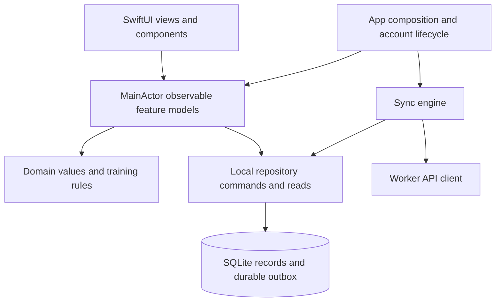

# SwiftUI architecture for OneSet

Researched: 2026-10-01. Status: research recommendation. The presentation and catalog boundaries have since been adopted; see [iOS architecture](agents/architecture.md) for current conventions. Persistence and sync remain future implementation.

## Recommendation

Use **native SwiftUI with feature-level observable models, a small domain layer, and local repositories**. This is a lightweight form of MVVM: an observable model coordinates a meaningful workflow, rather than assigning a view model to every view. Keep training records in a durable local database; run synchronization separately from presentation.

This recommendation is an engineering judgment based on OneSet's current code and approved scope. Apple documents model/view separation and Observation, but does not prescribe the MVVM name or this particular layering. Observation supports SwiftUI from iOS 17, matching the project's provisional deployment target. [Apple: managing model data](https://developer.apple.com/documentation/swiftui/managing-model-data-in-your-app), [project configuration](../OneSet.xcodeproj/project.pbxproj), [README](../README.md).

For persistence, **prefer GRDB as the initial SQLite access library**, behind the repository boundary. Treat that as a separate implementation decision: verify the selected release against the actual Xcode toolchain, iOS floor, transactions, recovery, and latency targets before adoption. SwiftData remains a viable alternative if those checks pass. Neither database choice requires TCA or a particular view-model pattern. The current [system design](system-design.md) intentionally leaves the library open.

## Baseline inspected during research

At the time of research, the working tree contained an onboarding and program-selection scaffold. [ContentView](../OneSet/Features/Onboarding/OnboardingFlowView.swift) owns a typed navigation path, unit, training-frequency preference, and selected program using `@State`; it passes bindings and callbacks into screens. [OnboardingRoute](../OneSet/Features/Onboarding/OnboardingRoute.swift) identifies program detail by ID. [ProgramCatalog](../OneSet/Services/Catalog/BundledProgramCatalog.swift) contains static value types and catalog data. [OneSetApp](../OneSet/App/OneSetApp.swift) constructs the root view. The baseline preceded the observable-model refactor; the links now point to the corresponding reorganized files.

There are no implemented account services, session workflow, durable repositories, outbox, or sync engine in the inspected app sources. The [system design](system-design.md), [sync protocol](sync-and-recovery.md), and [API contracts](api-contracts.md) describe proposed implementation. The approved requirements govern the choice: interrupted workouts recover locally (FR-05), expired credentials do not interrupt training (FR-24), and records save locally before successful-save UI (FR-25). NF-02 sets a measurable 100 ms p95 target; choosing an architecture does not demonstrate that target. [Requirements](requirements.md).

## Options considered

The assessments below are project-specific judgments, not benchmark results or universal rankings.

| Approach | Useful strengths | Cost or risk for OneSet | Assessment |
| --- | --- | --- | --- |
| Native SwiftUI models and local view state | Direct use of Apple's data flow, little ceremony, natural composition | Domain writes spread through views if ownership is left implicit | Good foundation for simple screens and components |
| Feature-level MVVM with repositories | Explicit workflow ownership, injectable dependencies, domain/storage separation | Requires discipline around model scope and asynchronous ordering | **Recommended** |
| TCA: composed reducers, actions, effects, stores | Consistent event handling and strong tools for testing composed flows and effects | Additional library concepts, action plumbing, upgrade surface, and team learning | Strong alternative if workflow complexity or team needs justify it |
| Full Clean Architecture / VIPER-style layering | Very explicit boundaries and replaceable components | A use-case object, protocol, and mapping for every operation adds indirection to this small app | Borrow dependency direction; avoid exhaustive layers now |

Apple's examples allow models to pass directly to views or through the environment; an observable model can serve several views. `@State` owns an instance's lifetime, and `@Bindable` supplies bindings. This supports selective workflow models rather than mandatory wrappers around every component. [Apple: managing model data](https://developer.apple.com/documentation/swiftui/managing-model-data-in-your-app), [Apple: Discover Observation](https://developer.apple.com/videos/play/wwdc2023/10149/).

TCA is a credible option. Its first-party documentation defines explicit state, actions, reducers and stores, with effects and dependency substitution; `TestStore` checks action-driven state changes and effect responses. For OneSet, that is attractive for finish/discard, entitlement and navigation interactions. Its extra structure is a tradeoff even its README acknowledges. My judgment is that the current scaffold and bounded launch scope favor native Swift; reassess if maintaining equivalent event/effect conventions becomes costly. TCA would still need the same durable repository and sync protocol. [Point-Free: TCA README](https://github.com/pointfreeco/swift-composable-architecture#basic-usage).

## Proposed boundaries and ownership

The diagram is a proposal derived from the [system design](system-design.md). Organize source folders around `Onboarding`, `Programs`, `ActiveSession`, `History`, and `Settings`; keep `Domain`, `Persistence`, `Sync`, `Services`, and the existing `DesignSystem` shared. Start within one app target; separate packages when a concrete reuse or build boundary warrants them.

| Boundary | Owns | Example |
| --- | --- | --- |
| SwiftUI views | Rendering, focus, expansion, sheets, input presentation | Existing `TrainingDayButton` stays a view with values and an action |
| Feature model | Workflow state, presentation values, command coordination, visible errors | `ActiveSessionModel` loads a session and coordinates complete/finish/discard |
| Domain | Stable IDs, workout-template/session distinction, prescriptions, unit conversion, previous-performance and progression rules | Value structs and enums; pure functions for calculations |
| Local repository | Atomic durable changes, snapshots, outbox bookkeeping, account scoping | `completeSet` commits the result, rest deadline and pending mutation together |
| Sync engine | Ordered upload selection, retry policy, acknowledgments, refresh/conflict handling | Retains sent payload while later edits accumulate locally |
| Service adapters | Network, identity/access, notifications, media, analytics, time | Inject narrow capabilities into their consumers |

Use `@MainActor @Observable` for presentation models. The app or a feature root owns each model once; descendants receive it explicitly, use `@Bindable` where needed, or obtain shared app state from the environment. Keep small temporary UI state in `@State`. Inject repository and service dependencies through initializers at the app composition boundary; introduce protocols or closure clients where substitution actually helps. Apple's Observation examples establish the ownership/binding primitives; the feature boundaries and injection policy are this report's proposal. [Apple: migrating to Observation](https://developer.apple.com/documentation/swiftui/migrating-from-the-observable-object-protocol-to-the-observable-macro).

Use `Sendable` value snapshots and commands across concurrency boundaries. An actor can protect sync bookkeeping or shared repository coordination, while the database library manages database access. Actor isolation permits other work at suspension points: an actor method containing `await` does not make an entire workflow indivisible or guarantee UI-event order. Protect invariants inside a synchronous database transaction, and use explicit sequencing and revision/generation checks around suspended work. [Swift language guide: concurrency](https://docs.swift.org/swift-book/documentation/the-swift-programming-language/concurrency/).

Keep the active-session coordinator and outbox processing owned beyond an individual screen's lifetime. Navigating away must not cancel the sole persistence path. On restart, rebuild the feature model from durable session data; navigation restoration cannot substitute for session recovery. Continue storing typed routes with identifiers rather than mutable records. Apple's navigation guide recommends lightweight path elements and supports data-driven path restoration. [Apple: understanding the navigation stack](https://developer.apple.com/documentation/swiftui/understanding-the-navigation-stack).

## Durability and synchronization shape the architecture

Implement these invariants in repository commands and the sync engine, regardless of presentation pattern:

1. An input change updates visible input immediately and starts an ordered local save. A successful-save indication follows commit. Failed storage retains the input and exposes failure; a long debounce is not a durability strategy.
2. Completing a set atomically saves its result, local rest deadline and pending server mutation. Only after commit does the model expose completed/saved state and start rest presentation. Finishing records local completion and pending upload in the same transaction.
3. The sync engine sends one session update at a time, retains its body and base revision, and preserves newer local edits. Acknowledgment clears only the operation it acknowledges. Refresh results are rejected or merged according to local generation and pending operations so delayed responses cannot replace newer work.
4. Expired auth pauses sync and defers reauthentication until local finish. Entitlement gates new sessions using cached verified validity; it cannot block finishing an existing session. Media and analytics do not participate in a training-save transaction.
5. Store account identity with local ownership. Account changes and sign-out cannot silently erase pending training data. Template updates affect future sessions; recorded prescriptions remain captured in started/completed sessions.

These are requirements and proposed protocol obligations, not guarantees supplied by `@Observable`, an actor, SwiftData, or TCA. [Requirements](requirements.md), [system design](system-design.md), [sync and recovery](sync-and-recovery.md).

## Persistence choice and migrations

GRDB provides transaction-wrapped writes, serialized database access and async access APIs. This makes the record-plus-outbox commit boundary explicit while allowing the caller to await storage without blocking presentation. Its Swift-concurrency guide also describes separate observable UI classes and plain database record structs. Those capabilities fit the proposed repository boundary; they do not implement OneSet's outbox or protocol automatically. [GRDB: transactions](https://github.com/groue/GRDB.swift/blob/master/GRDB/Documentation.docc/Transactions.md), [GRDB: concurrency](https://github.com/groue/GRDB.swift/blob/master/GRDB/Documentation.docc/Concurrency.md), [GRDB: Swift concurrency](https://github.com/groue/GRDB.swift/blob/master/GRDB/Documentation.docc/SwiftConcurrency.md).

SwiftData offers Apple-native model persistence, observable models and SwiftUI queries. Its default main context autosaves periodically, while `save()` explicitly persists pending changes and can throw. It also has versioned schemas and migration plans. Consequently, SwiftData is plausible, but default autosave cannot establish OneSet's save-before-success requirement. Evaluate explicit record-plus-outbox saving, rollback, account scoping, recovery and supported-OS behavior before selection; do not claim the framework cannot meet these needs. CloudKit integration does not implement the specified Worker/Neon synchronization. [Apple: preserving model data](https://developer.apple.com/documentation/swiftdata/preserving-your-apps-model-data-across-launches), [Apple: save](https://developer.apple.com/documentation/swiftdata/modelcontext/save()), [Apple: SchemaMigrationPlan](https://developer.apple.com/documentation/swiftdata/schemamigrationplan).

Version the local schema independently from the PostgreSQL schema and API payloads. Local state additionally includes drafts, timer deadlines and retry bookkeeping. Preserve pending payloads and captured prescriptions through upgrades; never recover a migration error by deleting the store. GRDB migrations run transactionally and track applied versions; shipped migrations should remain stable, and its destructive schema-reset option is unsuitable for retained training data. SwiftData requires corresponding versioned-schema/migration planning. [GRDB: migrations](https://github.com/groue/GRDB.swift/blob/master/GRDB/Documentation.docc/Migrations.md), [Apple: SchemaMigrationPlan](https://developer.apple.com/documentation/swiftdata/schemamigrationplan), [database guidance](agents/database.md).

## Adoption sequence

1. Keep existing small views and typed onboarding navigation. Move onboarding coordination into an observable model as real account actions and durable progress arrive.
2. Model domain identities and session snapshots using [CONTEXT.md](../CONTEXT.md), then implement the local store and repository transaction boundary before the logging screen.
3. Build one complete active-session slice: edit, complete a set, restore after interruption, finish offline. Inject time and storage failures; measure commit latency on supported devices.
4. Add sync and the specified account lifecycle, exercising unresolved uploads, auth expiration and stale responses before integrating history edits/deletion.
5. Extend with program/history models and service adapters. Add complexity where real workflows need it; consider TCA if composed effects and cross-feature transitions become difficult to maintain.

Future validation should focus on disk-save failure, force-quit recovery, timer restoration, edit ordering across suspension points, duplicate finish/retry, acknowledged payloads versus newer edits, migration of pending work, and account isolation. These checks are proposed implementation gates; this research did not implement or run them. The presentation architecture has since been adopted as described in [iOS architecture](agents/architecture.md); the persistence candidate and iOS/device floor remain provisional. [Requirements](requirements.md), [sync and recovery](sync-and-recovery.md), [README](../README.md).

Repository validation: `./scripts/validate.sh` passed the simulator build and seven existing onboarding UI tests. That validates the existing scaffold, not the proposed architecture, persistence or sync behavior.
