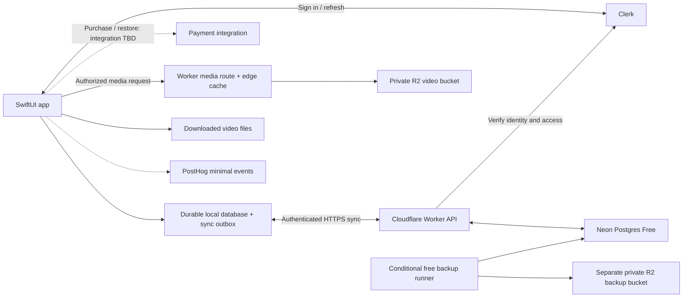

# System design

Status: design proposal implementing accepted requirements. Runtime behavior and provider costs must be verified with chosen SDK versions and current pricing before implementation. The database migration is applied; the app and services are not deployed.

## Components

Postgres stores content references and logs; it does not fetch video bytes or send them to a CDN. Workout input flows through durable device storage. Media has a separate path so streaming never occupies a database connection.

## iOS application

SwiftUI owns presentation. A local SQLite-backed database stores downloaded catalog data, enrollment/cycle state, history, draft sets, rest timestamps, cached entitlement and pending mutations. The specific library (e.g. native persistence framework versus SQLite wrapper) is an implementation choice pending SDK/device-floor review; require atomic record + outbox writes and explicit migration support.

Suggested modules: account/access, catalog, active workout, history, sync, media downloads. Active workout depends on local repositories and injected time, not directly on Clerk/payment services/network. Analytics is asynchronous and never a prerequisite for save/finish.

Writes serialize through a local transaction. Only after commit does UI confirm the save and schedule rest. A local storage failure displays an actionable failure and retains visible input; optimistic success alone is insufficient. Persist each input change efficiently; measure write latency rather than hiding data loss behind a long debounce.

App startup first restores an active session, then refreshes remote state when possible. User data is namespaced per account; never render one user's store to another. Sign-out/account switch with pending data must offer to sync first and explicitly explain any local-data removal; never silently clear the outbox.

## Worker API and Postgres

One modest Worker service with routes for catalog, owned training state, sync and media is sufficient. Verify Clerk tokens and derive user ownership at the boundary; no client-provided `user_id` authorizes access. Use a restricted database role, parameterized queries and an authenticated server-side Postgres connection. Driver/HTTP transaction support is a release spike: atomic session/sync writes require a supported transaction API, not unrelated statements.

The database uses the original ten tables plus completion marks. Resolve session ownership through its program run; only sessions have upload revisions. Timers are local. Template entries with null position are omitted from future workouts while their IDs remain valid for history. See the [database design](database/README.md) and [API contracts](api-contracts.md).

Neon Free initially. Use pooling/serverless connection behavior appropriate to Workers and avoid idle keepalive queries. Put writable user data only in Postgres; no public edge caching of history. Current catalog responses can use ETags for cache revalidation. No separate read replica, queue service or distributed lock platform is required initially.

Free CPU/request/storage limits must be measured with token verification, transactions and media authorization included. If the selected tier cannot meet the design, surface the cost/behavior tradeoff; a paid upgrade is not preauthorized merely by this document.

## Authentication and subscription

Account enrollment links a unique Clerk subject to OneSet user ID. The approved account choices on Welcome are Apple, Google, and email, with Log in for returning users. Email authentication uses a verification code. Continue and Log in resolve existing account state before routing; neither resets completed setup. Unfinished onboarding choices save locally on Continue and are not synced across devices. After authentication, onboarding can continue offline using the bundled catalog; subscription enrollment requires connectivity. Clerk session expiration is internal: active training continues locally; failed refresh prompts reauthentication after local finish. API rejects invalid tokens while local state remains intact.

Completed onboarding saves units, training frequency, and selected program to the backend on entering program overview after accepting or dismissing the trial offer. Offline completion persists locally and allows overview access; upload completed setup when connectivity returns. Intermediate steps remain local only. Cross-device restoration requires a successful completed-setup upload. The save must tolerate retries without duplicating enrollment or cycles; its API contract remains to be specified.

Unfinished onboarding progress survives app closure while signed in, but is cleared on sign-out. Local setup belongs to the authenticated account and must never be exposed to another account. Email entry and code verification use OneSet's existing visual styles, with change-email, resend-code, and invalid/expired-code handling.

If account setup lookup fails after authentication, continue from saved local state for that account when available; otherwise show retry rather than treating the account as new. Signing out with completed setup awaiting upload requires an explicit cancel-or-discard confirmation. Confirmed sign-out discards that local setup and its pending upload. These setup rules do not replace the separate protections for pending workout data.

Clerk owns account profiles and access; Postgres keeps only the Clerk user ID link plus training-specific preferences. Read name/email from Clerk instead of maintaining local copies. Server requests use trusted Clerk identity/access checks. OneSet preferences and active-program choices use the latest values saved to the server; no user revision or settings conflict flow is needed.

The earlier RevenueCat/StoreKit proposal concerns purchase/restore handling. Its integration with Clerk-managed access remains to be specified; this schema does not mirror subscription status or verification timestamps. The offline-start requirement needs an integration-provided validity limit cached on the device, separate from authentication-token expiry.

Server gates new protected starts/media issuance using verified access. Offline start relies on cached expiration, then preserves data at sync even if entitlement expired afterward. A forged client timestamp is not proof of payment. Preserve submitted training data without granting fresh subscription access; resolve entitlement disagreement separately. Offline access is a convenience, not tamper-proof licensing.

History, profile, subscription-management and preview access remain available without payment. Trials begin on successful enrollment in the store offer, not when a profile is created. Seven-day trial eligibility and actual localized price are obtained from the chosen store/payment integration. $4.89 is the founder's target and must not be hardcoded as a globally available storefront price.

## Protected video delivery

- Import immutable compressed video objects to private R2; keep `r2.dev`/public access disabled. Catalog exposes an immutable object key as the media identifier, without access credentials.
- App asks Worker for an authorized stream/download or short-lived media grant. Worker validates caller/access before any cached response. Gate full instructional media to active entitlement as a **design assumption**; unpaid program previews expose names/text, not necessarily video.
- Cache the common immutable bytes by media version, not by a user bearer token. Authorization still runs on every protected request; never allow an edge cache hit to bypass it. Grant validation, cache location and range behavior require a dedicated integration check.
- Support HTTP byte ranges, content type/length, cancellation and seek behavior. Cache partial responses only with a correct range-aware design. Do not use arbitrary token query strings in logs/analytics.
- Download only when a workout is explicitly opened on Wi-Fi; deduplicate already verified files by checksum/video key. Proposed policy: stop automatic downloads if connection becomes cellular, while user-initiated streaming remains allowed.
- Save into temporary files, verify checksum/length, then atomically rename. An interrupted download is never marked ready. Use bounded concurrency. Proposed local cache budget: 500 MB, evict least-recently-used clips outside the active workout; make unavailable clips clear if OS evicts storage.
- Downloaded clips remain usable offline. Revoking an online grant does not remotely remove already copied bytes; no DRM claim. Proposed expiry behavior: no fresh downloads after entitlement expiry; history retains text/instructions.

R2 caching mechanics depend on a custom domain/Worker route. See [official cache guidance](https://developers.cloudflare.com/cache/interaction-cloudflare-products/r2/) and [Worker Cache API example](https://developers.cloudflare.com/r2/examples/cache-api/). These sources establish available mechanisms, not a tested private-media implementation.

## Security and operational boundaries

TLS, verified account ownership, short-lived media access, private backups, limited storage/database credentials, and environment-separated secrets are required design controls. Personal training values stay out of logs and analytics. Error telemetry contains codes and aggregate IDs only where necessary, never request bodies or tokens.

Account deletion is a release requirement to specify and verify against distribution requirements. Proposed flow requires online reauthentication, erases owned server data and local state, disables identity/access, and records a minimal erasure instruction so disaster restore cannot resurrect the account. Explain that deleting an account and canceling a store subscription are separate actions. Retained encrypted operational backups age out; exact privacy wording requires review.

## Minimal analytics

| Event | Allowed properties |
| --- | --- |
| onboarding_completed | app version, selected unit, frequency |
| program_selected | catalog program IDs |
| trial_converted | product ID, conversion kind; authoritative deduplication |
| workout_started / workout_completed | program ID, app version, offline flag; no measured performance |
| sync_failed | stable error category, retryable flag, app version |

Use pseudonymous account identity where needed, no email/name/notes. Disable unnecessary autocapture and replay. Keep analytics/event volume controls inside the free allowance. Operational alerts must detect backup staleness as well as failure events; a missing job does not emit its own failure.

## Catalog publication

The founder's [program library](HIT_Workout_Program_Library.md) is the source for all ten gym-only programs. Convert it into a reviewed structured catalog with stable program, workout and exercise-slot IDs. Every exercise uses one working set with weight and reps. Keep shared instructions, stopping guidance, warmup guidance, rest duration and video key on the exercise; workout slots hold their rep ranges. Frequency derives from current workout entries.

Before import, verify program names, frequency, order, rep bounds, warmup exceptions, replacement guidance and video coverage. Preserve IDs across compatible edits. A removed template entry gets a null position so historical sessions and offline snapshots can still refer to it; never reuse its ID for another movement. Produce a readable catalog diff, validate in a disposable environment, and commit the complete catalog change in one transaction. Started sessions keep their copied content; future sessions use the new template.

Prepare short mobile-friendly videos, record checksums and MIME types, and upload immutable objects to private R2 keys. Verify playback and range requests through the authorized Worker before making a video selectable. Keep source masters separately. Publication credentials must be distinct from ordinary user API access. No admin application is planned for launch.
